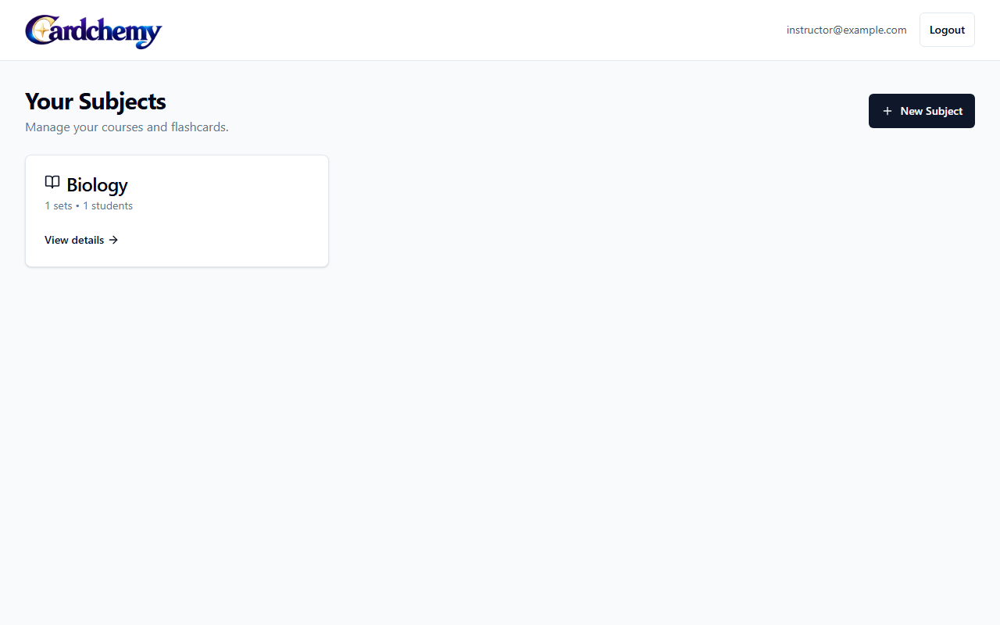
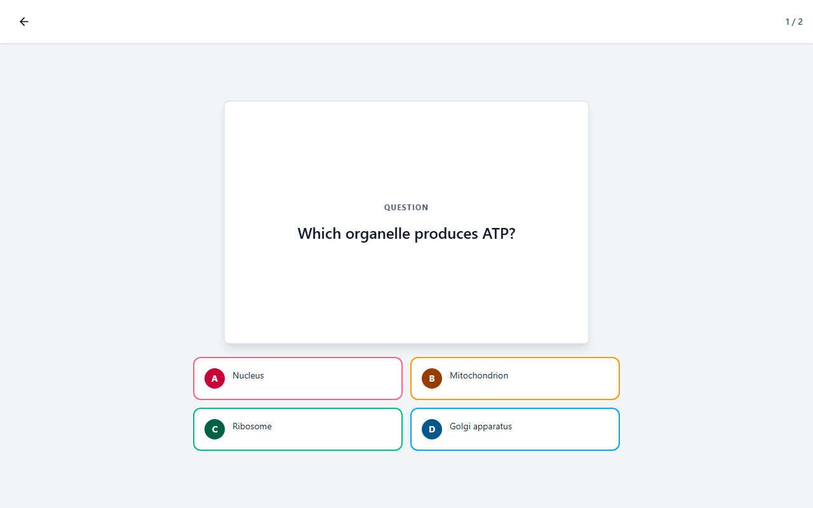
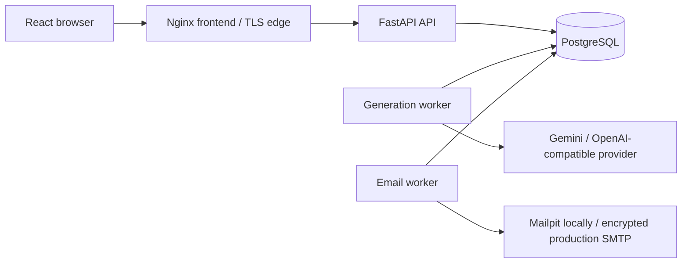

# Cardchemy


**Turn documents into memory.**

Cardchemy helps instructors turn lecture PDFs into source-grounded,
multiple-choice flashcards. Instructors own subjects, review and approve cards,
publish sets and invite students. Enrolled students study approved cards with
server-recorded answers and spaced repetition, and track completion, accuracy
and mastery. Cardchemy is a standalone project.

[Start Here](docs/00-START-HERE.md) explains the product;
[the public roadmap](ROADMAP.md) separates implemented features from proposals.
[Versioning](docs/VERSIONING.md), [the changelog](CHANGELOG.md) and
[releases](https://github.com/EoCiMrEo/Cardchemy/releases) identify versions and
artifacts. Local Docker Compose is the reference environment; production-shaped
configuration does not establish a live production service.

## Screenshots

These views use authored demonstration data.





## Architecture



FastAPI/Pydantic and async SQLAlchemy own authorization and transactions.
PostgreSQL 16 stores content, progress, sessions and durable generation/email
queues; Alembic alone evolves the schema. React, TypeScript and Vite power the
browser, which keeps access tokens in memory and waits for durable answer saves.
PDF extraction, validated AI and SMTP run in separate workers.
See the [system overview](docs/architecture/SYSTEM-OVERVIEW.md),
[project map](PROJECT-MAP.md) and [accepted decisions](docs/decisions/ADR-000-INDEX.md).

## Prerequisites

For the built stack, install Docker Engine 24+ / Compose 2.20+ and Python
3.11–3.13 for bootstrap. Windows/macOS use Docker Desktop in Linux-container
mode. Linux/amd64 is supported; arm64 is best effort. Images are built locally
unless your deployment explicitly selects verified published artifacts.

Native development/tests also use Node.js 24.x, npm 11.x, the hashed Python
development lock, Playwright Chromium and PostgreSQL 16.
[RUNTIMES.md](docs/RUNTIMES.md) owns precise support and
[local setup](docs/development/LOCAL-SETUP.md) covers installation modes.

## Quick local setup

From the repository root on a fresh clone:

```text
python scripts/bootstrap_env.py
docker compose config --quiet
docker compose up -d --build --wait
docker compose exec backend python -m app.cli create-instructor --email instructor@example.com
```

The instructor command prompts for a password. Open
[the application](http://127.0.0.1:8080) and
[local Mailpit](http://127.0.0.1:8025); these ports are template defaults.
Students register through instructor invitations. Additional instructors need
the explicit CLI flag in [authentication guidance](docs/AUTHENTICATION.md).

Root `.env` is the sole user-managed configuration file and
[.env.example](.env.example) is its only template. Bootstrap generates three
independent secrets once and refuses overwrites. Preserve an existing file and
skip bootstrap. No backend/frontend `.env` is needed. Nonempty process settings
override root values, then validated defaults apply. Only public `VITE_*`
values reach the browser.

Generation starts disabled. Configure the generation worker's credential/model
and set `AI_PROVIDER_ENABLED=true` before uploading for AI generation. Calls can
spend provider quota. Compose isolates AI credentials to that worker and SMTP
credentials to the email worker. [Configuration](docs/CONFIGURATION.md) defines
ranges, consumers and applying changes. Stop with `docker compose down`,
retaining data volumes; choose exactly one documented development/production
override. [Local setup](docs/development/LOCAL-SETUP.md) covers native editing.

## Try without provider quota

After installing the [test dependencies and Chromium](docs/TESTING.md), run
this automated demonstration from root:

```text
python scripts/test_journey.py
```

It uses real API/workers, PostgreSQL, Mailpit and Chromium with an authored
deterministic provider making no remote AI call. The journey exercises upload,
generation, review, publication, invitation, enrollment, study and persisted
progress. Random loopback ports, temporary databases and generated credentials
isolate it from operator settings. The harness removes its processes,
containers and data afterward; this is an automated demonstration rather than
a persistent interactive installation. Initial image/dependency downloads
still need normal network access.

For a bounded interactive installation, use
`python scripts/test_journey.py --demo --demo-minutes 30`.
The [demo guide](docs/DEMO.md) explains private generated sign-in details,
packaged Nginx candidates and automatic cleanup.

## Secure, operate, back up and upgrade

Before accepting real users, follow [deployment](docs/DEPLOYMENT.md): put TLS
at the edge, keep API/database ports private, use secure cookies and encrypted
production SMTP, and configure trusted origins and process credentials.
Mailpit is local/test capture, not a production relay.

Create encrypted off-host PostgreSQL backups and rehearse restoration into a
separate database. Protect signing and source-encryption keys separately.
For upgrades, stop admission and drain writers/workers, verify a usable backup,
retain existing Compose/database identities and authentication settings as
explained in [the configuration upgrade note](docs/CONFIGURATION.md#existing-installations-and-cardchemy-defaults),
select the intended release, migrate with Alembic, verify all heads and restore
traffic after readiness/application checks. Preserve populated volumes and
installation secrets; never stamp past a failed migration. Commands and
rollback limits belong to [database operations](docs/DATABASE_OPERATIONS.md).

[Safe diagnostics](docs/OBSERVABILITY.md) expose request/job IDs, latency,
queue/worker state, model usage/cost and privileged audits. Export, explicit
account deletion and retention are guarded operator commands. Protect their
output and configure proxy/collector log rotation. External aggregate telemetry
is disabled by default and requires an explicit reporting command.

## Privacy and product limits

Extracted text, evidence and prompts leave the deployment when a remote AI
provider is selected. Provider/SMTP contracts, user disclosures, backup expiry
and legal suitability belong to the operator. Temporary PDFs are encrypted
and cleaned up; generated quotations remain in cards until content deletion.
[Privacy controls](docs/PRIVACY.md) define retention/export/deletion and
independent provider, backup and mail copies.

- Instructors are provisioned by CLI; public registration creates invited
  students. No email-verification flow exists.
- Cards have four distinct options and one answer. AI cards need approval
  before publication/study; manual creation is supported by API.
- Study payloads hide answers; general authorized card reads expose them.
  This is study tooling, not exam secrecy.
- Study is online-first, English-only and has no offline/PWA answer queue.
  OCR is local, optional and needs its documented build/runtime.
- Provider governance is process-local; replicas need divided quotas or an
  approved distributed design. Metrics are best effort, not a billing ledger;
  audits are diagnostic, not tamper-proof.
- Live provider/production SMTP and manual spoken assistive-technology evidence
  have separate gates. Offline tests do not establish those results.

See [study behavior](docs/architecture/STUDY-PROGRESS-FLOW.md),
[AI providers](docs/AI_PROVIDERS.md), [PDF generation](docs/PDF_GENERATION.md)
and [accessibility](docs/ACCESSIBILITY.md) for precise boundaries.

## Troubleshooting

| Symptom | Next step |
| --- | --- |
| Bootstrap refuses to overwrite `.env` | Preserve it; edit/validate settings using the configuration guide. |
| Generation is unavailable | Check enablement, worker-only credential/model and the safe job failure code in AI-provider guidance. |
| Source expired or job cannot retry | Inspect job/source retention and PDF recovery; upload a new authorized source if needed. |
| API/worker is unhealthy | Inspect safe logs, DB readiness, migration heads and heartbeat using observability guidance. |
| Invitation/reset mail is absent | Inspect outbox safe codes; follow SMTP/ambiguous-delivery recovery in email guidance. |
| Study save fails | Keep the logical answer and use Retry; progression waits for durable persistence. |
| Migration fails | Keep writers stopped and follow database recovery; preserve data and backups. |

Find commands in [the guide index](docs/README.md). Share safe codes and
request/job IDs for support, never private documents, credentials,
prompts/responses or reset/invitation links.

## Verify and contribute

| Working directory | Command | Purpose |
| --- | --- | --- |
| Root | `python scripts/check_context.py` | Context files and active local links |
| `backend` | `python -m pytest -q` | Offline contracts; service/live gates need separate opt-ins |
| `frontend` | `npm run check` | Types, lint, units, components/coverage, build and Chromium |
| Root | `python scripts/test_services.py postgres` | Disposable database/integrity/migration rehearsal |
| Root | `python scripts/test_services.py mailpit` | Disposable transactional email integration |
| Root | `python scripts/test_journey.py` | Real application journey without provider quota |

[TESTING.md](docs/TESTING.md) is command authority. Follow
[CONTRIBUTING.md](CONTRIBUTING.md) and the [Code of Conduct](CODE_OF_CONDUCT.md),
and use issue/PR templates for focused nonsensitive changes. Vulnerabilities
use the GitHub private form in [SECURITY.md](SECURITY.md). See
[VERSIONING.md](docs/VERSIONING.md) for version policy,
[RELEASING.md](docs/RELEASING.md) for signature/artifact verification, and the
changelog and release page for publishing status.

Code and documentation are copyright 2026 EoCiMrEo and licensed under
[Apache-2.0](LICENSE), with [NOTICE](NOTICE). Supplied logos/icons and optimized
exports have [separate brand terms](BRANDING.md), including limited
redistribution permission and no trademark/endorsement grant. Third-party
components retain their own licenses.
