# AI Generation Flow

Current truth, verified against source on 2026-09-17. Start with
[project orientation](../00-START-HERE.md) and the [project map](../../PROJECT-MAP.md).

## Purpose and scope

Trace an instructor's PDF from bounded upload to a durable generation job,
validated draft cards, instructor review, and publication. This covers the
application's trust and worker boundaries; provider availability and pricing
must be checked separately by the operator.

## Key components

| Component | Responsibility |
|---|---|
| Instructor subject page, API service, generation hook | Reserve/upload with stable operation keys; recover and poll jobs; cancel or manually retry |
| Generation router and job service | Instructor ownership, idempotency, quotas, bounded body, source encryption, durable states |
| Generation worker | Claim fencing, heartbeat, extraction, job deadline, atomic result persistence, recovery and cleanup |
| PDF processor | Page-preserving extraction in a killable child process; optional local OCR |
| Compatibility graph facade | Retain the `ainvoke` caller boundary while delegating to the plain Python pipeline |
| AI pipeline, provider adapters, governor | Evidence packing, structured requests, budgets, one retry owner, shared concurrency and rate admission |
| Grounding/contracts and flashcard service | Strict card shape, trusted provenance, quote/answer validation, duplicate rejection, persistence validation |
| Instructor set review and subject service | Explicit approval and publication; students receive approved cards from published sets |

## Primary flow

```mermaid
flowchart LR
    UI[Instructor PDF form] --> Reserve[Reserve job]
    Reserve --> Upload[Bounded raw PDF upload]
    Upload --> Queue[(PostgreSQL queued job and encrypted source)]
    Queue --> Worker[Claim and renew lease]
    Worker --> Extract[Isolated page extraction]
    Extract --> Pipeline[Pack evidence and generate]
    Pipeline --> Validate[Schema, grounding and distinctness]
    Validate --> Commit[Atomic draft set and cards]
    Commit --> Review[Instructor approval]
    Review --> Publish[Publish set]
```

1. `POST /flashcards/generation-jobs` reserves metadata with a required
   `Idempotency-Key` and returns `202`, a job ID, and `Location`. Matching
   owner/key/metadata replays the reservation; different metadata returns a
   typed `409`. The provider and model are snapshotted onto the job.
2. `PUT /flashcards/generation-jobs/{id}/source` accepts a raw PDF body, counts
   streamed bytes as well as declared length, and checks media type/signature.
   Identical reuploads replay; conflicting source bytes return `409`. Accepted
   upload atomically writes AES-256-GCM ciphertext, charges quota, and queues
   the job. No extraction or model call runs in the API request.
3. A separate `python -m app.worker` process claims an eligible row with
   PostgreSQL `FOR UPDATE SKIP LOCKED`. Worker identity, a random claim token,
   lease expiry, and heartbeats fence each state update and final commit.
4. The worker decrypts the temporary source and performs bounded extraction in
   a spawned child process, called through a worker thread. Ordered pages retain
   their original numbering. OCR is disabled by default and runs only when
   native extraction produces no usable document text.
5. The pipeline assigns trusted page/section chunk IDs, estimates the token,
   cost, and logical-request plan, then greedily packs evidence using rendered
   prompt estimates. A one-pack document skips summaries; every direct batch
   receives the complete pack, including chunks allocated zero cards.
   Multi-pack documents summarize packs and reduce summaries in bounded levels;
   the server tracks source coverage. Largest-remainder allocation and batched
   generation preserve each logical chunk's card quota.
6. Summary and generation stages begin with a single compatibility request
   before fan-out; a failure cancels outstanding siblings. Every physical
   provider attempt passes through the worker-wide rolling RPM/input-TPM
   governor. A worker-wide semaphore bounds calls across concurrent jobs.
7. Provider output is parsed by strict Pydantic contracts, then checked against
   the trusted chunk and normalized quote. The answer must occur in the
   verified quote. Page/section come from the server, never from model output.
   A deterministic pass rejects unclear/ungrounded cards and near duplicates;
   bounded refill rounds request only the missing global count.
   Versioned generation/map/reduce prompts request feasible assigned targets,
   compact parallel options and exact contiguous quote/answer spans. Refill passes
   bounded accepted question/answer exclusions as untrusted context; summaries
   remain navigation aids. Full accepted cards retain deterministic duplicate
   enforcement. See [evaluation](../AI_EVALUATION.md) for bounds and evidence.
8. Success requires exactly the requested number of cards. A final transaction
   revalidates the lease, creates the unpublished set and unapproved cards,
   records telemetry, deletes the source, and completes the job. A rollback
   leaves no partial result. Instructor approval and publication are separate
   subsequent actions.

## Important invariants

- Only the owning instructor can manage a subject's generation jobs. Status
  routes never return source PDF bytes or prompts. Static `/generation-*`
  routes register before the dynamic `/flashcards/{flashcard_id}` route.
- Job states are `awaiting_upload`, `queued`, `running`, `completed`, `failed`,
  and `cancelled`. Queued work survives page/API restarts; interrupted worker
  execution can be recovered after its lease expires.
- All cards have four unique options and exactly one matching answer. Generated
  quality scores never approve a card. Publication requires at least one
  approved card; PostgreSQL triggers also protect the final approved card in a
  published set. See [data model](DATA-MODEL.md).
- Document text and summaries are untrusted data in separate system/user
  messages. Schema, deterministic validation, database constraints, and atomic
  persistence remain the trust boundary.
- Upload, page, text, queue, active-job, daily quota, retained-source, time,
  token, cost, concurrency, automatic-attempt, and manual-retry bounds are
  operator configuration. PostgreSQL advisory locking serializes admission and
  quota charges. Use [PDF operations](../PDF_GENERATION.md) and
  [configuration](../CONFIGURATION.md) for settings; do not duplicate defaults
  across the context system.
- The source key is independent of the authentication secret. Success,
  cancellation, and permanent failures remove ciphertext. Final retryable
  failures retain it for a configured period (24 hours by default); cleanup
  removes expired ciphertext and disables retry. Upload reservations expire
  after 15 minutes by default. Drain/cancel retained jobs before key rotation.
- A job has at most one persisted result set. This does **not** guarantee one
  provider execution: infrastructure/lease recovery can repeat remote work.

## Failure and edge cases

| Condition | Result |
|---|---|
| Oversized/empty upload, unsupported media/signature | Stable bounded API error before queueing |
| Malformed/encrypted/over-limit/image-only PDF or OCR failure | Permanent job failure; source removed |
| Token/cost preflight refusal | No provider request; precise limit code |
| Request exceeds context or safe rate-token budget | Refused before that request |
| Invalid strict schema | `invalid_generated_cards`; no persisted result |
| Refill cannot supply enough grounded distinct cards | `insufficient_grounded_cards`; no partial set; retained source permits bounded manual retry |
| Provider timeout/network/408/409/425/429/5xx | One application loop: initial attempt plus at most three retries, at least three seconds apart; honor usable longer `Retry-After` |
| Provider 400/401/403/404 | Permanent compatibility/credential/access/model error; no request retries |
| Retry hint exceeds maximum wait | Stop rather than retry earlier than requested; retryable source can be retained |
| Handled pipeline/provider failure or whole-job timeout | Finalize with available telemetry; no automatic whole-job replay |
| Retryable internal infrastructure failure or dead lease | Bounded automatic job requeue with exponential backoff/full jitter; stale worker cannot commit |
| Running cancellation | Record request; heartbeat/stage/finalization checks stop work and prevent result commit; source removed when finalized |
| Missing/expired source or decryption-key mismatch | Retry unavailable or permanent source failure |

Gemini SDK retries are disabled (`attempts=1`); provider adapters own the single
per-call retry loop. Rate waits occur outside the per-call timeout and inside
the whole-job timeout. The governor is process-local: multiple worker replicas
need divided per-replica limits or a distributed governor.

Job telemetry records estimated/used tokens, configured costs, rejected/accepted
cards, planned logical requests, physical attempts, retries, wait time, cached
input tokens, and bounded stage counts. Estimates keep the maximum run plan;
usage/attempt counters accumulate across manual retries. Zero configured prices
mean cost unavailable. Telemetry is finalized on success or handled failure;
process crashes or cancellation before finalization can omit attempts. It is
not an exact provider billing ledger.

Pipeline-only content-free quality diagnostics separately expose prompt versions,
raw/grounded/distinct/accepted/missing counts per round, fixed rejection categories,
refill use and uncertain request counts. They preserve existing persisted count
semantics and exclude content and source IDs. Preflight includes rendered reduction
overhead and a bounded refill envelope. Actual rendered context and remaining-job
input/output/cost reservations protect concurrent requests; completed responses
reconcile to usage while failures/cancellation conservatively retain uncertain
capacity until the run ends. Summary output planning remains estimated, so later
rendered checks and reported usage are authoritative. No output-cap, allocation,
grounding or strict complete-result threshold changed.

## Relevant source paths and validation

- UI: [SubjectDetails.tsx](../../frontend/src/pages/instructor/SubjectDetails.tsx),
  [useGenerationJobs.ts](../../frontend/src/hooks/useGenerationJobs.ts),
  [GenerationJobCard.tsx](../../frontend/src/components/generation/GenerationJobCard.tsx),
  [SetView.tsx](../../frontend/src/pages/instructor/SetView.tsx).
- HTTP/persistence: [generation router](../../backend/app/routers/generation.py),
  [job service](../../backend/app/services/generation.py),
  [generation models](../../backend/app/models/generation.py),
  [source encryption](../../backend/app/services/source_storage.py).
- Worker: [entry point](../../backend/app/worker.py),
  [worker](../../backend/app/workers/generation.py),
  [PDF processor](../../backend/app/services/pdf_processor.py),
  [active graph facade](../../backend/app/agents/graph.py).
- AI: [pipeline](../../backend/app/ai/pipeline.py),
  [versioned prompts](../../backend/app/ai/prompts.py),
  [chunking](../../backend/app/ai/chunking.py),
  [contracts](../../backend/app/ai/contracts.py),
  [grounding](../../backend/app/ai/grounding.py),
  [providers](../../backend/app/ai/providers/__init__.py),
  [governor](../../backend/app/ai/rate_limit.py).
- Review/publish: [flashcard service](../../backend/app/services/flashcard.py),
  [subject service](../../backend/app/services/subject.py),
  [publication triggers](../../backend/alembic/versions/20260914_0001_phase2_baseline.py).
- Regressions: [job tests](../../backend/tests/test_generation_jobs.py),
  [pipeline tests](../../backend/tests/test_ai_pipeline.py),
  [provider tests](../../backend/tests/test_ai_providers.py),
  [governor tests](../../backend/tests/test_ai_rate_limit.py),
  [PostgreSQL persistence tests](../../backend/tests/postgres/test_generation_job_persistence.py).
  [Evaluation](../AI_EVALUATION.md) and [testing](../TESTING.md) distinguish
  deterministic offline coverage from opt-in live provider checks.

## Related ADRs and next reading

- [ADR-006: Grounded generation validation](../decisions/ADR-006-grounded-generation-validation.md)
- [ADR-008: PostgreSQL durable jobs](../decisions/ADR-008-postgresql-durable-jobs.md)
- [ADR index](../decisions/ADR-000-INDEX.md)
- [AI provider operations](../AI_PROVIDERS.md), [system overview](SYSTEM-OVERVIEW.md),
  [backend map](../../backend/MOC.md), [frontend map](../../frontend/MOC.md)
