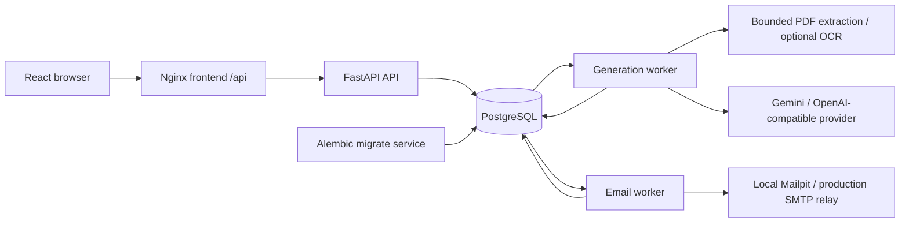

# System Overview

Current truth, verified against source on 2026-09-16. Read
[orientation](../00-START-HERE.md) and the [project map](../../PROJECT-MAP.md) first.

## Purpose and scope

Explain the boundaries between the browser, HTTP API, PostgreSQL, generation
worker, email worker, and external services. Product detail belongs in the
individual flow documents; deployment commands belong in the operational guides.

## Key components and primary flow

The diagram shows the default built Compose stack. Native Vite development
replaces the Nginx edge with a local `/api` proxy. Workers poll PostgreSQL;
the database does not push jobs. Alembic runs before API/workers start.

| Boundary | Owner and contract |
| --- | --- |
| Browser | UI, in-memory access token, transient study state, job polling; the API owns authorization and persistence |
| Edge | SPA/deep-link serving, same-origin `/api`, cookie path rewriting and security headers |
| API | Validated HTTP contracts, role/ownership/enrollment checks, transactions, quotas/rate limits and enqueue |
| PostgreSQL | Business records, sessions/invitations/reset tokens, study receipts, durable jobs/encrypted sources, outbox and shared limits |
| Generation worker | Leased/fenced jobs, subprocess PDF bounds, typed grounded AI, atomic set/card result and cleanup |
| Email worker | Leased/fenced outbox delivery through SMTP with bounded retries and explicit ambiguity recovery |
| External provider | Receives extracted evidence and prompts; document content is untrusted input and cannot choose configuration or tools |

**Generation:** Instructor UI reserves/uploads a job; the worker extracts,
generates and validates cards, then commits the complete result. Instructor
review/approval/publication precedes student eligibility. Read
[AI generation](AI-GENERATION-FLOW.md).

**Study:** A student obtains approved cards in a published set within an enrolled subject.
The server derives correctness, updates scheduling/progress and writes the
answer receipt atomically. Read [study/progress](STUDY-PROGRESS-FLOW.md).

**Email:** Reset requests, password changes and recipient-bound invitations
enqueue in the initiating database transaction. The email worker renders the
message and performs SMTP outside the request transaction. A post-send crash
can be ambiguous, so automatic delivery cannot promise exactly once. Read
[auth](AUTH-FLOW.md) and [email delivery](../EMAIL_DELIVERY.md).

## Important invariants

- API/workers verify all configured Alembic heads; startup does not create tables.
- Root `.env` is the sole supported file configuration. Nonempty process values
  override it; validated defaults follow. Settings resolve paths independent of cwd.
- Base Compose isolates provider credentials to the generation worker and SMTP
  credentials to the email worker. Native operators must inject only what each
  process needs; a native shared root file is not equivalent to container isolation.
- The base stack exposes frontend and Mailpit UI on loopback; DB/API remain
  internal. Production requires an operator-controlled TLS proxy, HTTPS origins,
  strong secrets and real encrypted SMTP; Mailpit is excluded by profile.
- PostgreSQL supplies both durable queues and shared admission/rate state; there
  is no required Redis, Celery, vector database or LangGraph runtime.
- Provider concurrency/RPM/TPM admission is shared within one generation worker
  process. Multiple replicas require quota division or a distributed governor.
- `postgres_data` holds durable data and encrypted temporary PDFs; application
  containers are replaceable. Local Mailpit capture is not production data.

## Failure and edge cases

Readiness fails when PostgreSQL cannot answer; liveness reports the API process.
Worker health probes check DB connectivity, not end-to-end queue throughput.
Leases recover crashed claims; fencing rejects stale writes. SIGTERM stops new
claims and gives active work bounded drain time. Timeout/provider failure does
not automatically replay an expensive pipeline. Ambiguous SMTP delivery requires
operator review. These contracts are explained in the deeper flow/operation docs.

Production deployment is documented, but a live production installation,
centralized structured logs, complete privacy/export policy and complete
observability are not established by this documentation. See
[current state](../development/CURRENT-STATE.md) and the active roadmap.

## Relevant source paths

[API entry](../../backend/app/main.py), [database lifecycle](../../backend/app/database.py),
[settings](../../backend/app/config.py), [generation worker](../../backend/app/workers/generation.py),
[email worker](../../backend/app/workers/email.py), [worker shutdown](../../backend/app/workers/shutdown.py),
[frontend routes](../../frontend/src/App.tsx), [API client](../../frontend/src/services/api.ts),
[Vite proxy](../../frontend/vite.config.ts), [Nginx](../../frontend/nginx.conf),
[base Compose](../../docker-compose.yml), [production override](../../docker-compose.prod.yml).

## Related decisions and next reading

[Schema ownership](../decisions/ADR-004-alembic-schema-ownership.md),
[root configuration](../decisions/ADR-007-root-configuration.md),
[durable jobs](../decisions/ADR-008-postgresql-durable-jobs.md),
[session/role boundaries](../decisions/ADR-009-session-and-role-boundaries.md),
[transactional email](../decisions/ADR-010-transactional-email.md).
Continue with [data model](DATA-MODEL.md), [backend MOC](../../backend/MOC.md),
[frontend MOC](../../frontend/MOC.md), [configuration](../CONFIGURATION.md)
or [deployment](../DEPLOYMENT.md).
