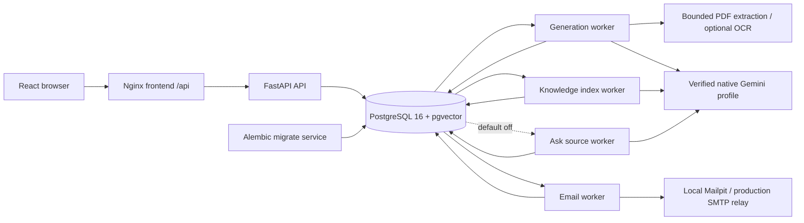

# System Overview

Current source-only Ask uses `related_knowledge_navigation_v8`, `visual_source_id_v5` and `literal_subject_admission_v2` at Alembic head `20261002_0033`. Fresh installations remain default-off. The retained local installation was enabled after its measured release gates on 2026-10-04; see the [closure evidence](../../.agent/logs/2026-10-03/2026-10-03-lane6-final-closure-and-activation.md). Historical policies and database rows remain immutable and readable; they cannot execute as new jobs.

## Purpose and scope

Explain the boundaries between the browser, HTTP API, PostgreSQL, generation
worker, email worker, and external services. Product detail belongs in the
individual flow documents; deployment commands belong in the operational guides.

## Key components and primary flow

```mermaid
flowchart LR
    Browser[React browser] --> Edge[Nginx frontend /api]
    Edge --> API[FastAPI API]
    API --> DB[(PostgreSQL 16 + pgvector)]
    Migrate[Alembic migrate service] --> DB
    DB --> Gen[Generation worker]
    Gen --> PDF[Bounded PDF extraction / optional OCR]
    Gen --> Provider[Verified native Gemini profile]
    Gen --> DB
    DB --> Index[Knowledge index worker]
    Index --> Provider
    Index --> DB
    DB -. default off .-> Ask[Ask source worker]
    Ask --> Provider
    Ask --> DB
    DB --> Email[Email worker]
    Email --> SMTP[Local Mailpit / production SMTP relay]
    Email --> DB
```

The diagram shows the default built Compose stack. Native Vite development
replaces the Nginx edge with a local `/api` proxy. Workers poll PostgreSQL;
the database does not push jobs. Alembic runs before API/workers start.

| Boundary | Owner and contract |
| --- | --- |
| Browser | UI, in-memory access token, transient study state, job polling; the API owns authorization and persistence |
| Edge | SPA/deep-link serving, same-origin `/api`, cookie path rewriting and security headers |
| API | Validated HTTP contracts, role/ownership/enrollment checks, transactions, quotas/rate limits and enqueue |
| PostgreSQL | Business records, sessions/invitations/reset tokens, study receipts, durable jobs/encrypted sources, outbox, shared limits and mandatory pgvector foundation |
| Generation worker | Leased/fenced jobs, subprocess PDF bounds, typed grounded AI, atomic set/card result and cleanup |
| Knowledge index worker | Canonical-page document embeddings in an explicit compatible space; staged reindex and atomic Subject cutover |
| Ask source worker | At most one query embedding and one bounded source-ID judgment over authorized exact text and bounded original-page PNGs, fenced usage and atomic exact page-offset references; no answer generation or verifier |
| Email worker | Leased/fenced outbox delivery through SMTP with bounded retries and explicit ambiguity recovery |
| External provider | Receives extracted evidence and prompts; document content is untrusted input and cannot choose configuration or tools |

**Generation:** Instructor UI reserves/uploads a job; the worker extracts,
generates and validates cards, then commits the complete result. Instructor
review/approval/publication precedes student eligibility. Read
[AI generation](AI-GENERATION-FLOW.md).

**Study:** A student obtains approved cards in a published set within an enrolled subject.
The server derives correctness, updates scheduling/progress and writes the
answer receipt atomically. Read [study/progress](STUDY-PROGRESS-FLOW.md).

**Email:** Reset requests, password changes and recipient-bound invitations
enqueue in the initiating database transaction. The email worker renders the
message and performs SMTP outside the request transaction. A post-send crash
can be ambiguous, so automatic delivery cannot promise exactly once. Read
[auth](AUTH-FLOW.md) and [email delivery](../mail-server/EMAIL_DELIVERY.md).

**Subject Knowledge and Ask AI:** PostgreSQL stores private documents,
content/pages, index revisions/chunks/vectors, capacity counters and durable
index/Ask jobs. The index worker continues to embed Knowledge. The new Ask
path in this checkout is separately default-off: at most one current-question
query embedding, authorized retrieval, at most one bounded source-ID
judgment and up to three locally derived exact, page-labeled related excerpts.
The approved ADR-023/024 navigation contracts label all references
as unverified and open the corresponding original lecture PDF page in a lazy
authenticated PDF.js viewer. A separate revision-bound AES-GCM block archive
retains original uploads; exact-hash attachment restores old missing originals.
Transient embedding transport failure may use bounded local lexical search.
It creates no generated or verified answer. Admission needs a matching
Subject active space, current embedding and source-judge prices, and the
source-window/access release gate; existing private history remains readable until the approved
development data reset. Embedding 001 remains default while model 2 is an
isolated optional staged space. The retained local schema is at `0033` with Ask enabled; every installation must verify matching services and its own cutover.
See [ADR-023](../decisions/ADR-023-original-pdf-source-navigation.md)
and [ADR-024](../decisions/ADR-024-gemini-source-id-judge.md).
An independent enrolled-student Published Knowledge route lists current
reviewed/published lectures, searches their eligible pages locally and serves
authenticated original-PDF ranges. It remains available while Ask admission
is disabled, and repeats enrollment/publication/revision/space authorization
on each page or range request.
Instructor publication is independent from card/set publication. Retrieval
requires current principal access plus published ready/active corpus and
embedding-space predicates inside Subject-scoped SQL; citations are reauthorized
on read. Typed instructor/student browser surfaces manage Knowledge and private
conversations without receiving provider credentials. Read the
[Knowledge flow](SUBJECT-KNOWLEDGE-FLOW.md).

## Important invariants

- API/workers verify all configured Alembic heads; startup does not create tables.
- Root `.env` is the sole supported file configuration. Nonempty process values
  override it; validated defaults follow. Settings resolve paths independent of cwd.
- Base Compose isolates provider credentials to generation/index/Ask workers
  and limits SMTP credentials
  to the email worker. Native operators must inject only what each
  process needs; a native shared root file is not equivalent to container isolation.
- The base stack exposes frontend and Mailpit UI on loopback; DB/API remain
  internal. Production requires an operator-controlled TLS proxy, HTTPS origins,
  strong secrets and real encrypted SMTP; Mailpit is excluded by profile.
- PostgreSQL supplies both durable queues and shared admission/rate state; there
  is no required Redis, Celery, external vector database or LangGraph runtime.
  PostgreSQL 16 and the reviewed pgvector extension are mandatory even with
  `RAG_ENABLED=false`; the flag controls product work, not migration heads.
- Provider concurrency/RPM/TPM admission is shared within one generation worker
  process. Multiple replicas require quota division or a distributed governor.
- `postgres_data` holds durable data, encrypted original-PDF archives and
  encrypted temporary generation PDFs; application
  containers are replaceable. Local Mailpit capture is not production data.

## Failure and edge cases

Readiness fails when PostgreSQL cannot answer; liveness reports the API process.
Worker health probes check their own loop heartbeat and DB connectivity;
neither establishes end-to-end queue throughput or remote-service availability.
Leases recover crashed claims; fencing rejects stale writes. SIGTERM stops new
claims and gives active work bounded drain time. Timeout/provider failure does
not automatically replay an expensive pipeline. Ambiguous SMTP delivery requires
operator review. These contracts are explained in the deeper flow/operation docs.

The API and workers use closed structured logs, server-issued correlation,
safe centralized errors, PostgreSQL request/worker metrics and transactional
privileged audits. [Observability](../operations/OBSERVABILITY.md) describes diagnostic
limits and explicitly triggered optional reporting. [Privacy](../security/PRIVACY.md)
owns provider disclosures and operator-mediated export/deletion/metadata
retention. A live production installation and deployment-specific legal
compliance remain separate from these implemented controls. See
[current state](../development/CURRENT-STATE.md) and the active roadmap.

## Relevant source paths

[API entry](../../backend/app/main.py), [database lifecycle](../../backend/app/database.py),
[settings](../../backend/app/config.py), [generation worker](../../backend/app/workers/generation.py),
[email worker](../../backend/app/workers/email.py), [worker shutdown](../../backend/app/workers/shutdown.py),
[frontend routes](../../frontend/src/App.tsx), [API client](../../frontend/src/services/api.ts),
[Vite proxy](../../frontend/vite.config.ts), [Nginx](../../frontend/nginx.conf),
[base Compose](../../docker-compose.yml), [production override](../../docker-compose.prod.yml).

## Related decisions and next reading

[Schema ownership](../decisions/ADR-004-alembic-schema-ownership.md),
[root configuration](../decisions/ADR-007-root-configuration.md),
[durable jobs](../decisions/ADR-008-postgresql-durable-jobs.md),
[session/role boundaries](../decisions/ADR-009-session-and-role-boundaries.md),
[transactional email](../decisions/ADR-010-transactional-email.md),
[Subject Knowledge boundaries](../decisions/ADR-012-subject-knowledge-and-rag-boundaries.md),
[Embedding 2 spaces](../decisions/ADR-018-gemini-embedding-2-space.md),
[source-only Ask](../decisions/ADR-022-related-knowledge-primary-ask.md), and
[historical two-request Ask](../decisions/ADR-019-two-request-local-support-ask.md).
The [Knowledge flow](SUBJECT-KNOWLEDGE-FLOW.md) distinguishes the schema
foundation from later upload, indexing, retrieval and conversation work.
Continue with [data model](DATA-MODEL.md), [backend MOC](../../backend/MOC.md),
[frontend MOC](../../frontend/MOC.md), [configuration](../operations/CONFIGURATION.md)
or [deployment](../operations/DEPLOYMENT.md).
