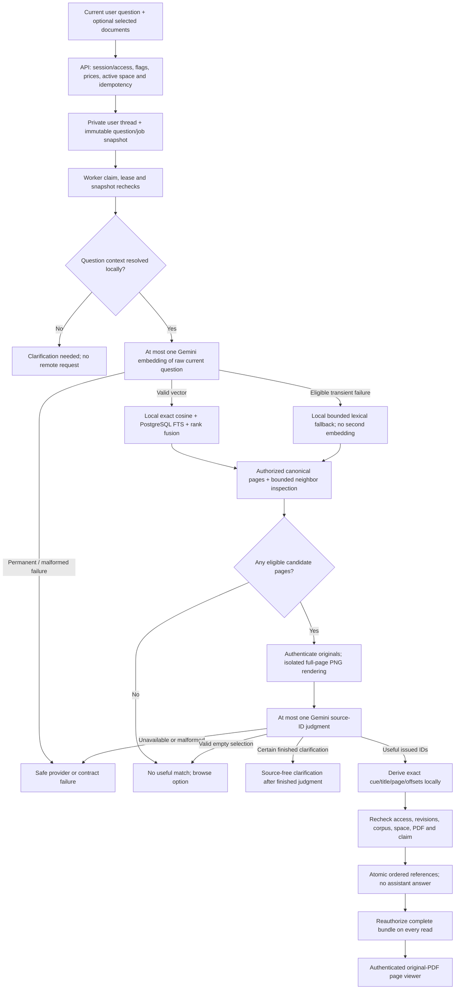
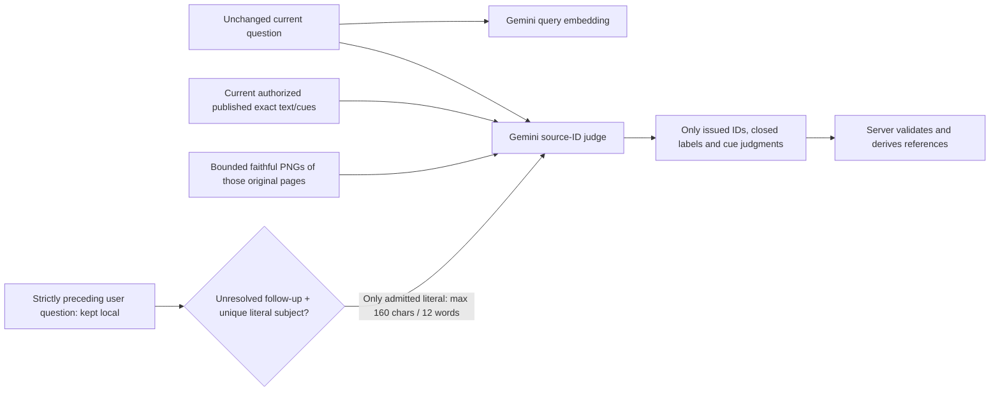
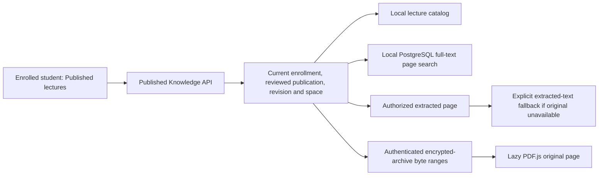

# Ask AI and published lecture browsing

Ask AI finds original lecture pages for the learner to read. It shows up to
three exact, currently authorized **unverified related references**; it does
not compose an answer. Gemini can still participate through query embedding
and source-ID judgment. Receiving PDF links instead of prose is the intended
source-only architecture.

The current immutable contracts are `related_knowledge_navigation_v8`,
`visual_source_id_v5` and `literal_subject_admission_v2`. Module filenames are
canonical; policy IDs remain versioned to protect historical jobs and data.

## The current Ask job

The fallback changes **retrieval**, not the source-judge contract. A job labeled
`lexical_fallback` may still make its one source-ID judgment if candidates
exist. No candidate means no judge call. Judge unavailability remains a
provider failure; it is never relabeled a true no-match. Both possible remote
stages have zero automatic retries and zero answer/verifier calls. Unknown
execution or cost remains unknown; manual Retry separately acknowledges
possible extra cost.

The bounded candidate inspection uses up to 30 chunks, 12 pages and 8,192
estimated tokens, with nearby pages within two pages of an eligible anchor.
The source judge sees a slate of up to four original pages. Its fixed model
is native Gemini `gemini-3.5-flash-lite`, HIGH thinking, at most 32,768 input
and 4,096 thinking-inclusive output tokens, with a 120-second deadline.

## Exactly what crosses the provider boundary

A clear question stays raw. For an eligible unresolved follow-up, the unique
literal prior subject is bound at admission with exact identity/hash/offset
metadata and rechecked before dispatch and persistence. Full previous
questions, full history, assistant responses, raw PDF bytes, unpublished
material and other Subjects are excluded. Input text/images are untrusted
evidence. A model cannot issue a new source ID, citation, answer or title.

The local server keeps at most three distinct-page cues, each at most 480
characters. It never pads with a weak page. Any invalid member withdraws the
entire reference bundle. The quote sits beside the PDF page; extracted-text
offsets do not establish a visual highlight.

## Independent Published lectures browser

This browse/search route creates no Ask job and sends no Gemini request. It
remains available while Ask is disabled or finds no useful page. Its local
search is a separate feature, not evidence that Ask silently stopped using
Gemini. Likewise, showing extracted text because an original is missing is a
**viewer fallback**, distinct from Ask's lexical retrieval fallback.

Fresh installations keep Ask default-off. Admission needs explicit RAG,
embedding, Ask and source-judge enablement, valid prices, active compatible
Knowledge and the released source/access policy. A configured key or migration
head alone does not activate it. See the [dated installed configuration](README.md#models-and-settings-at-a-glance);
a past request's actual mode requires that job's safe stage/result metadata.

Sources: [ADR-023](../decisions/ADR-023-original-pdf-source-navigation.md),
[ADR-024](../decisions/ADR-024-gemini-source-id-judge.md),
[Ask service](../../backend/app/services/rag_answers.py),
[Ask worker](../../backend/app/workers/rag_answer.py),
[visual contract](../../backend/app/ai/source_judgment_visual.py),
[visual provider](../../backend/app/ai/providers/source_visual.py),
[page preparation](../../backend/app/services/source_visual_preparation.py),
[lecture browse API](../../backend/app/routers/published_knowledge.py),
[Ask panel](../../frontend/src/components/rag/AskAiPanel.tsx),
[PDF viewer](../../frontend/src/components/rag/OriginalPdfPage.tsx).
