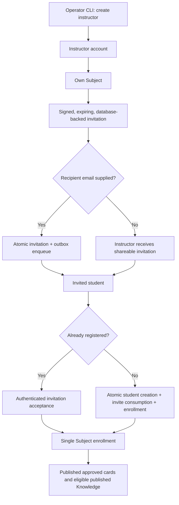
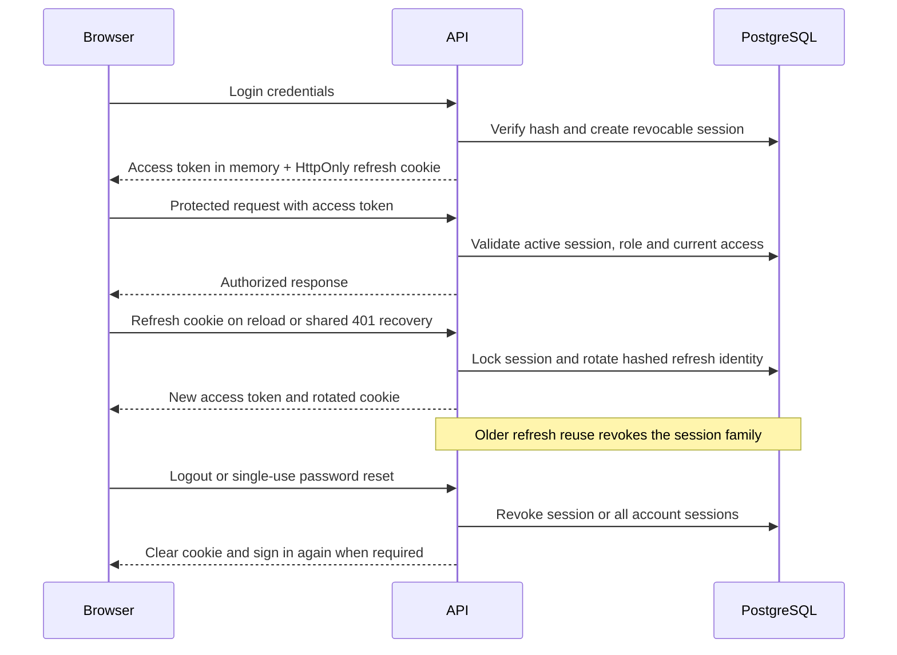
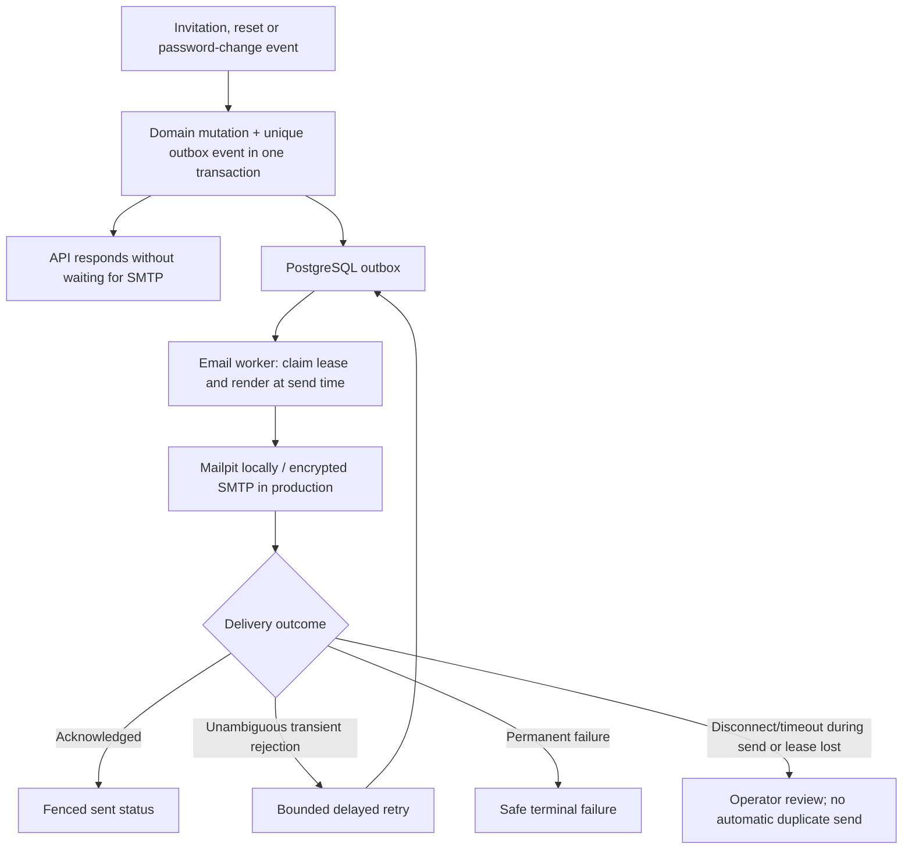

# Authentication, invitations and transactional email

Operators create instructors through the CLI. Public registration creates only
invited students. The API owns normalized identities, session validation,
invitation consumption and role/access checks.

An optional recipient binding must match the student's normalized email.
Expiry, row locks, single-use consumption and unique enrollment control races.
Additional instructor provisioning requires `--allow-additional`. No account
email-verification workflow is implemented.

## Browser sessions and recovery

JWT purpose, issuer/audience, identity/JTI/time and session checks stay
server-owned. Refresh tokens never appear in JSON or browser storage.
Recovery responses are generic; reset consumption, password change, session
revocation and notification enqueue share one transaction.

## Outbox to SMTP

Outbox rows store event/template data, not rendered link-bearing message bodies.
The worker renders valid links at send time and uses a stable Message-ID.
Exactly-once SMTP delivery is not guaranteed: a relay can accept a message
before its acknowledgement is lost. Production uses verified STARTTLS or
implicit TLS; local Mailpit captures sensitive messages for local/test use only.
Logs omit recipients, bodies, credentials and invitation/reset URLs.

Sources: [auth contract](../architecture/AUTH-FLOW.md),
[auth router](../../backend/app/routers/auth.py),
[auth service](../../backend/app/services/auth.py),
[subject service](../../backend/app/services/subject.py),
[browser session](../../frontend/src/context/AuthContext.tsx),
[API refresh coordination](../../frontend/src/services/api.ts),
[email service](../../backend/app/services/email.py),
[email worker](../../backend/app/workers/email.py),
[email operations](../mail-server/EMAIL_DELIVERY.md).
