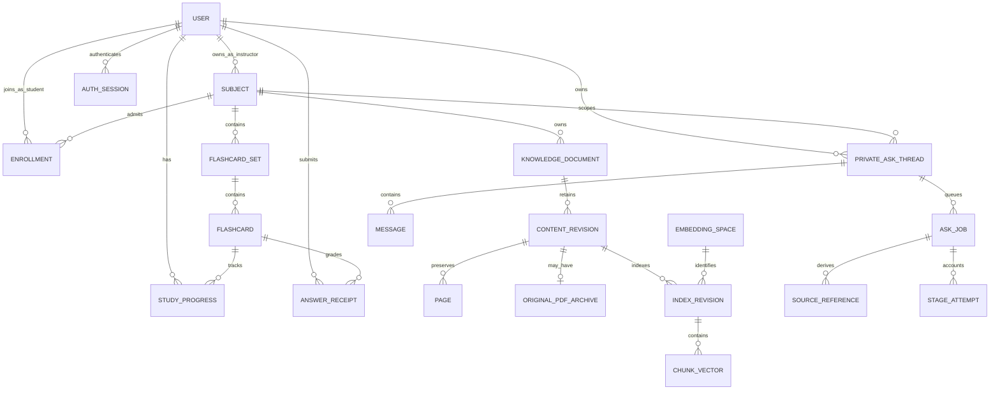
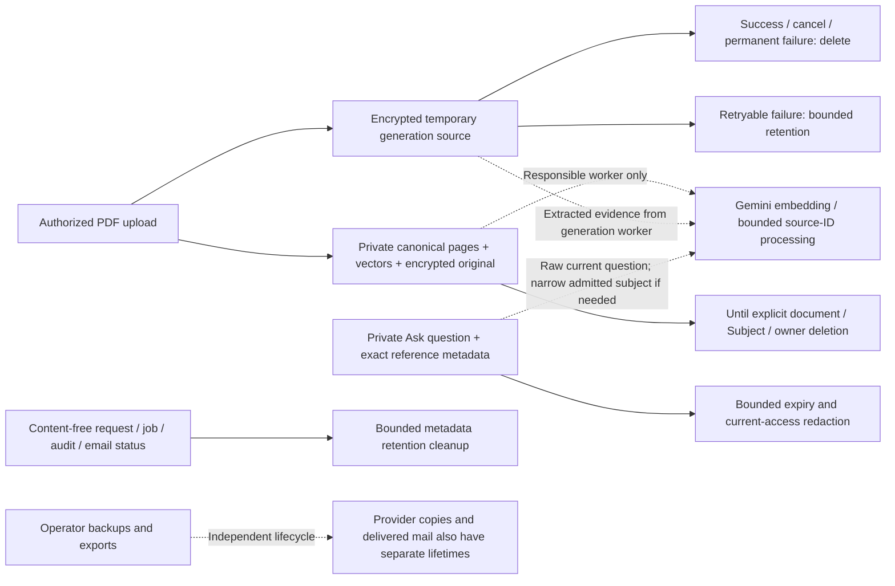
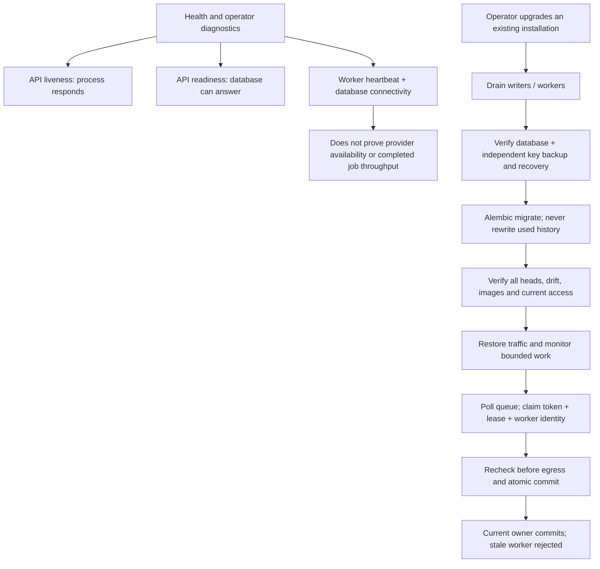

# Data, privacy and operations

PostgreSQL is the authoritative store for accounts, learning content, durable
jobs, progress and outbox. This conceptual map highlights ownership; it omits
individual fields and composite constraints, which remain defined by models
and used Alembic migrations.

An instructor cannot read a student's private Ask thread. Job/set Knowledge
links preserve provenance without making card publication depend on Knowledge
publication. Removing Knowledge detaches surviving card links. Removing a
Subject or owning account cascades the corresponding owned data; explicit
operator deletion requires quiesced writers and appropriate recovery evidence.

## Content lifetime and egress

The original Knowledge archive uses an independent revision-bound encryption
key, separate from temporary generation sources and JWT signing. Encryption at
rest does not prevent authorized provider egress. Routine logs, telemetry and
safe errors exclude source text, questions, prompts, raw responses, secrets and
link-bearing messages. Optional aggregate telemetry is default-off and runs
only when explicitly requested; API/workers do not continuously push it.

Own-account JSON export uses an allowlist and consistent database snapshot.
It excludes credentials, tokens/hashes, claim/idempotency secrets, vectors,
encrypted archive bytes, staged candidate cards and other users' records.
Database deletion does not erase already delivered mail, provider copies,
backups or downloaded exports; operators own those separate controls.

## Health, worker fencing and upgrades

Expired leases permit only bounded infrastructure recovery. Handled paid
pipeline failures and uncertain provider execution are not automatically
replayed. SMTP uncertainty requires operator review. Graceful shutdown stops
new claims and gives active work a bounded drain window. Never downgrade a
real database or delete a populated volume as a verification shortcut.

Sources: [data model](../architecture/DATA-MODEL.md),
[models](../../backend/app/models), [Alembic](../../backend/alembic/versions),
[privacy operations](../../backend/app/services/privacy.py),
[diagnostics](../../backend/app/services/operations.py),
[audit](../../backend/app/services/audit.py),
[privacy guide](../security/PRIVACY.md),
[observability](../operations/OBSERVABILITY.md),
[database recovery](../database/DATABASE_OPERATIONS.md).
