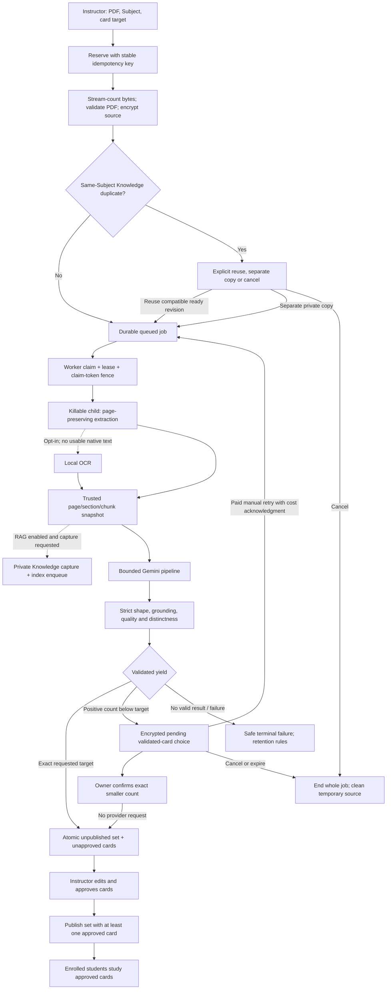
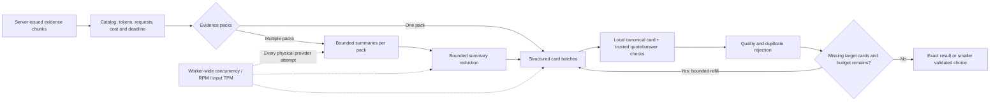

# PDF to reviewed flashcards

An owning instructor submits a bounded PDF and requested card count. The API
reserves and uploads; a separate worker extracts, calls Gemini and validates.
No expensive PDF or AI operation runs in the HTTP request.

An unchanged explicit Knowledge revision is a no-op. Duplicate reuse does not
capture or embed that revision again. Raw upload accounting still applies.
Knowledge publication is independent of flashcard publication; a flashcard
failure can leave valid private Knowledge. Cancellation never removes an
independent reviewed Knowledge revision.

## Inside the Gemini pipeline

Repository default: native Gemini `gemini-3.8-flash`, LOW thinking. The closed
supported catalog is listed in the [visual guide index](README.md#models-and-settings-at-a-glance).
The selected provider/model/catalog/schema policy is frozen on the job;
incompatible workers fail safely rather than substitute a model.

Each accepted card has trimmed nonempty front/back, four unique options and
one matching answer. The verified answer must occur in its trusted exact
quote; the server derives page/section provenance. Model output cannot approve
a card or choose source IDs/configuration. Summaries help planning and do not
replace original evidence.

Generation has one application retry owner: at most three transient retries
with delays of at least three seconds and usable longer `Retry-After`.
SDK retries are disabled. Permanent request/auth/model failures do not retry.
A handled failure or whole-job timeout does not automatically rerun the whole
paid pipeline. Final set/cards/status/source cleanup commit together; a stale
worker cannot commit a partial or duplicate result.

Sources: [generation contract](../architecture/AI-GENERATION-FLOW.md),
[job service](../../backend/app/services/generation.py),
[worker](../../backend/app/workers/generation.py),
[pipeline](../../backend/app/ai/pipeline.py),
[grounding](../../backend/app/ai/grounding.py),
[catalog](../../backend/app/ai/gemini_catalog.py),
[candidate storage](../../backend/app/services/candidate_storage.py),
[job UI](../../frontend/src/components/generation/GenerationJobCard.tsx).
