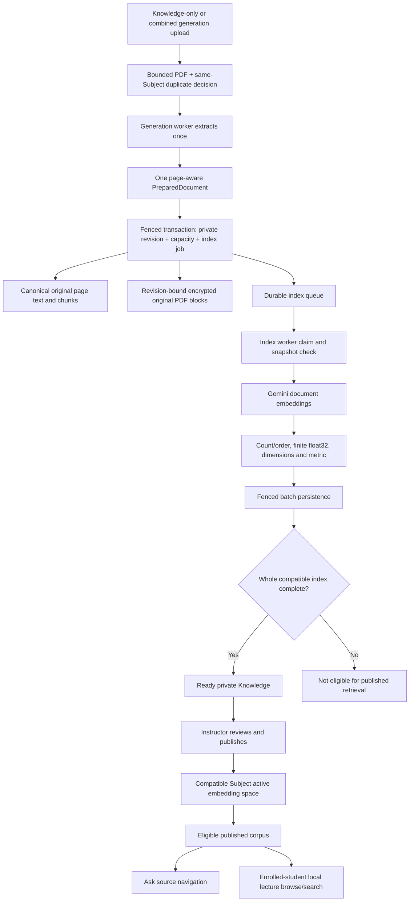
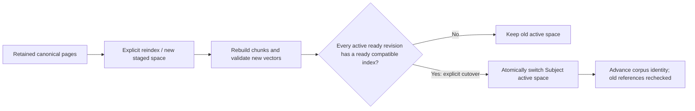

# Subject Knowledge: capture, indexing and publication

Knowledge is a retained lecture corpus. It stores canonical pages/chunks,
validated vectors and an encrypted original PDF independently of draft cards.
It starts private and needs explicit instructor review/publication.

Default document embeddings use native Gemini `gemini-embedding-001`,
1,536-dimensional float32 cosine vectors and `RETRIEVAL_DOCUMENT` task mode.
Ask uses the same compatible space with `QUESTION_ANSWERING` query task mode.
No API or browser process needs an embedding key.

## Revisions and embedding-space cutover

Space identity includes provider, endpoint, model, revision, text format,
dimensions, representation, metric and task modes. Optional
`gemini-embedding-2` uses `gemini2_qa_section_v1` and a distinct staged identity,
even at 1,536 dimensions. Vectors are never silently mixed. Reindex uses stored
canonical pages rather than re-uploading or inventing source text from cards.

Search SQL filters current owner/enrollment, Subject, optional selected
documents, reviewed publication, readiness, active revisions, corpus and
embedding space before ranking. Unpublish, replacement, deletion or access
loss withdraws eligibility. Ask references and PDF reads repeat the checks.
Deleting Knowledge detaches surviving card links; deleting job history does
not delete independent Knowledge.

The durable original archive is separate from temporary generation ciphertext.
Older revisions without original bytes need an instructor attachment matching
both exact SHA-256 and page count. That attachment does not reindex, create a
new content revision or call a provider.

Sources: [Knowledge contract](../architecture/SUBJECT-KNOWLEDGE-FLOW.md),
[capture](../../backend/app/services/knowledge_capture.py),
[index service](../../backend/app/services/knowledge_indexing.py),
[index worker](../../backend/app/workers/knowledge_index.py),
[retrieval](../../backend/app/services/knowledge_retrieval.py),
[original PDF storage](../../backend/app/services/knowledge_pdf.py),
[ADR-018](../decisions/ADR-018-gemini-embedding-2-space.md).
