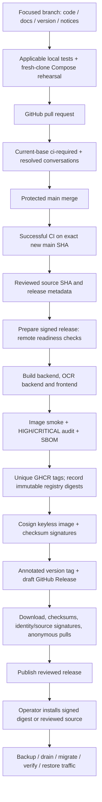
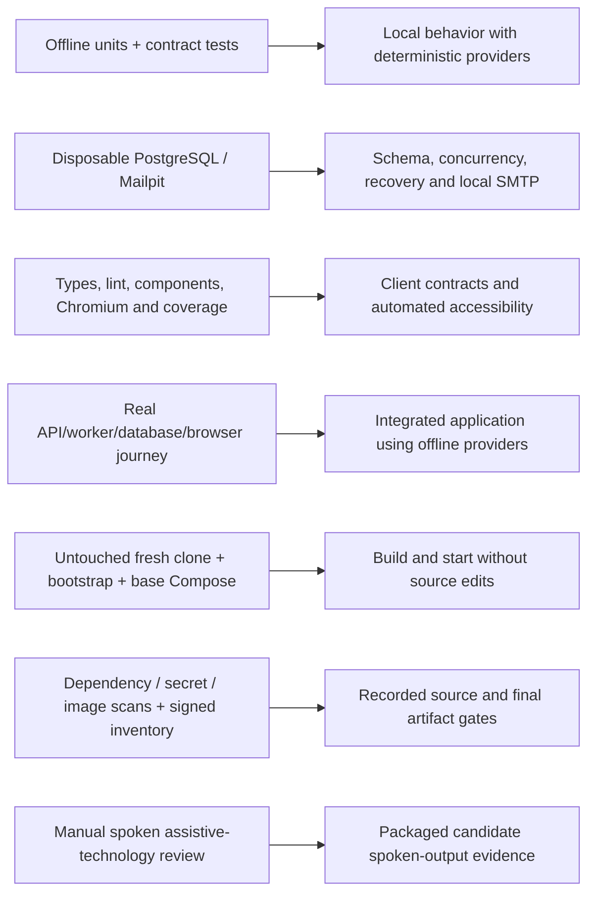

# Source rollout, signed release and installation

A protected source merge, a published version and an operator deployment are
distinct events. This map describes the maintained release mechanism; dated
release evidence and GitHub's actual state establish which steps completed.
It does not claim that the illustrated checks ran for a particular version.

`main` protection requires a PR, current-base `ci-required`, resolved
conversations and administrator enforcement; force push/deletion are forbidden.
The release workflow rejects a different repository/ref/SHA, missing required
protection/CI/readiness, or an already used tag/release identity. Its exact
source SHA is checked again before privileged publication.

The three release images are backend, optional-OCR backend and frontend.
Registry tags are mutable labels; consumers use signed `image@sha256:...`
identities. Cosign verifies GitHub Actions OIDC identity and the reviewed source
SHA. The Git tag is annotated; artifact/image trust comes from keyless
signatures and their source binding, not a claim of a GPG-signed Git tag.

## What each verification establishes

Ordinary tests spend no AI quota and send no production email. Fixture,
skipped and deselected tests do not prove live-provider or deployment success.
For 0.2.0, the operator reported successful functional application checks and
explicitly waived repeating the manual spoken-output check; the automated
and signed-release checks remain applicable. The manual node above describes
the normal release procedure, not a claim of a new 0.2.0 spoken-output test.
A future paid evaluation needs a separate exact model/endpoint/price/call/
token/time/cost approval. Operators retain their own TLS, SMTP, backup, privacy
and activation obligations for each installation. Version publication does not
change AI flags or validate every arbitrary lecture/query.

Sources: [release runbook](../ci-cd/RELEASING.md),
[versioning](../ci-cd/VERSIONING.md), [CI](../ci-cd/CI.md),
[release workflow](../../.github/workflows/release-sbom.yml),
[release validator](../../scripts/check_release.py),
[branch protection definition](../../.github/branch-protection.json),
[testing](../development/TESTING.md),
[accessibility](../ui/ACCESSIBILITY.md),
[deployment](../operations/DEPLOYMENT.md).
