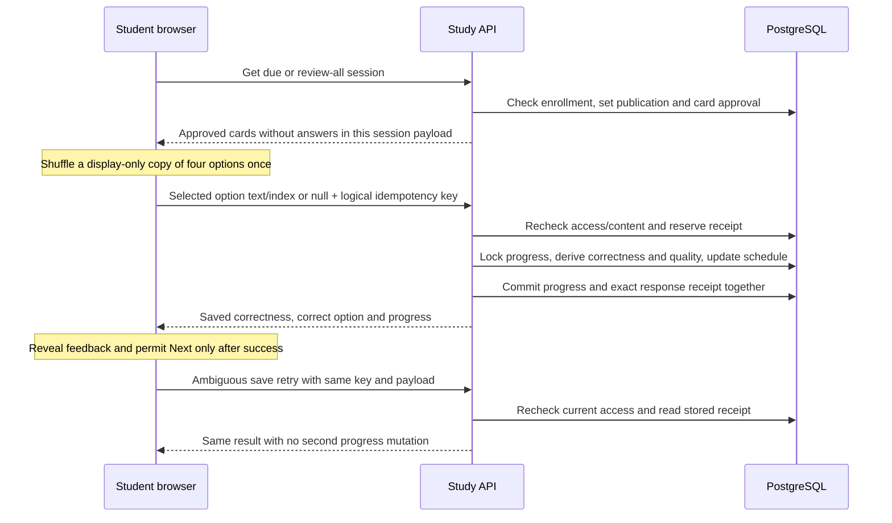
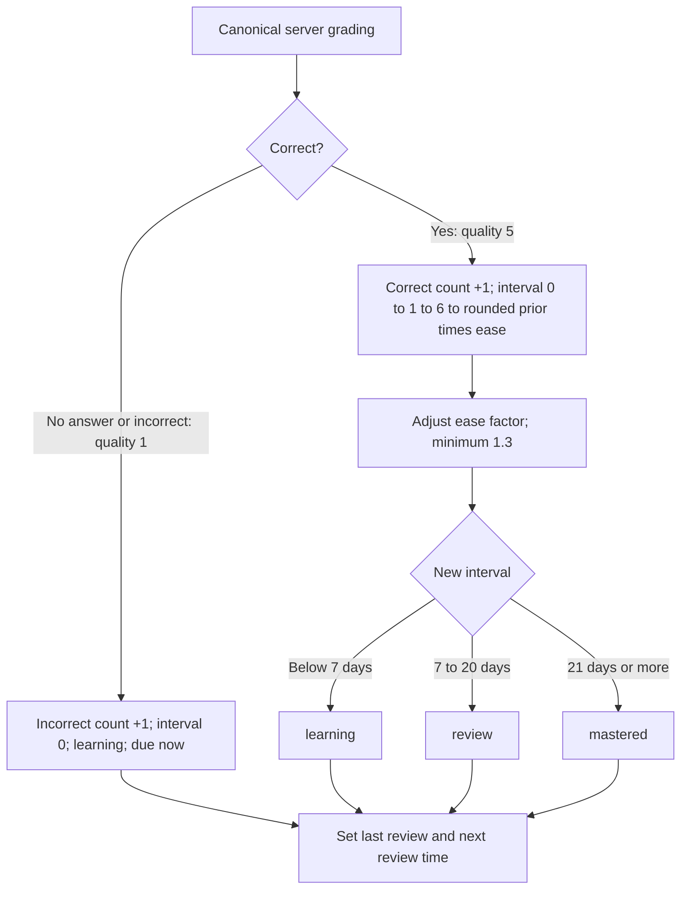

# Study, answer receipts and progress

An enrolled student studies approved cards from a published set. The server
grades the selected option and commits scheduling/progress with a replayable
answer receipt. The browser waits for that durable acknowledgement before
feedback or advancing.

Changed key reuse conflicts. Distinct logical answers use distinct keys;
concurrent answers serialize progress updates. Click and timer paths share a
submission lock. There is no offline answer outbox. General authorized card
reads currently expose answers, so the answer-free study-session contract does
not establish exam secrecy.

## Scheduling

Cards are `new` before any attempt. Due mode selects unseen or due cards;
review-all ignores due dates and orders least recently reviewed first.

| Metric | Meaning, restricted to currently approved cards |
| --- | --- |
| Progress | Distinct cards answered correctly at least once / total cards |
| Accuracy | Correct attempts / all attempts, including null as incorrect |
| Attempted / compatible Completion | Distinct cards attempted / total cards |
| Mastery | Cards in `review` or `mastered` / total cards |

Later wrong answers do not erase Progress credit. The UI's completion trophy
uses the exact nonzero distinct-ever-correct count, not a rounded percentage.
These metrics are separate; old API fields retain their established meanings.

Sources: [study contract](../architecture/STUDY-PROGRESS-FLOW.md),
[study router](../../backend/app/routers/study.py),
[grading and scheduling](../../backend/app/services/flashcard.py),
[progress and receipts](../../backend/app/models/flashcard.py),
[study page](../../frontend/src/pages/student/StudyMode.tsx),
[idempotency tests](../../backend/tests/test_study_idempotency.py).
