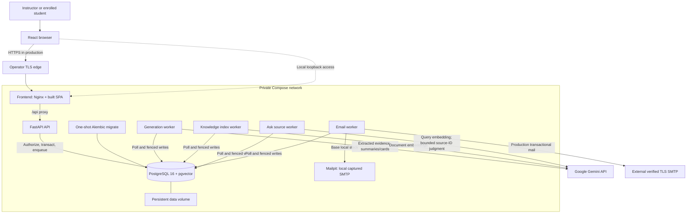
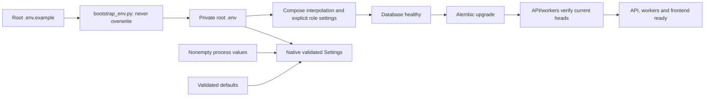

# System, deployment and trust boundaries

The browser uses a same-origin Nginx edge, a FastAPI API and PostgreSQL 16 with
pgvector. Four separate workers handle generation, indexing, Ask and email.
PostgreSQL owns business data and durable queues. Redis, Celery and an external
vector database are not required.

The base stack publishes frontend and Mailpit UI on loopback; API and database
remain internal. The production override uses real encrypted SMTP and an
operator-controlled TLS edge. Native development replaces built Nginx with
Vite's local API proxy. The stack can be healthy while optional AI work is
disabled; health is not provider availability or proof of queue throughput.

## Startup and configuration

Root `.env` is the only user-managed file configuration. For native processes,
nonempty process values override the root file, then validated defaults apply.
Schema changes use Alembic; application startup never creates tables or stamps
past a failed migration. Database and encrypted archives survive container
replacement in the persistent volume.

## Credential and authorization boundaries

| Component | Authority or credentials |
| --- | --- |
| Browser | Access token in memory, protected refresh cookie; public `VITE_API_URL` only |
| API | Validate session/role/access, enforce quotas and atomic changes; no provider key |
| Generation worker | Flashcard AI key; PDF extraction and strict local validation |
| Index worker | Embedding key; current Knowledge revision and space fencing |
| Ask worker | Embedding and separate source-judge keys; current session/access/source fencing |
| Email worker | SMTP credentials; outbox lease and send-stage fencing |

Instructor writes require Subject ownership. Student reads require enrollment;
study additionally requires a published set and approved cards. Knowledge
search additionally requires reviewed/published ready active revisions and
the Subject's compatible embedding space. The backend repeats these checks;
browser route guards only support the interface.

Sources: [system contract](../architecture/SYSTEM-OVERVIEW.md),
[Compose](../../docker-compose.yml),
[production override](../../docker-compose.prod.yml),
[settings](../../backend/app/config.py),
[API entry](../../backend/app/main.py),
[Nginx](../../frontend/nginx.conf),
[deployment](../operations/DEPLOYMENT.md).
