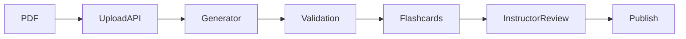

# Repository Context System Plan

## Implementation status — completed 2026-09-16

All eight implementation steps and success criteria below are complete in this
checkout. This file remains a reusable implementation reference. Begin future
project work at [AGENTS.md](AGENTS.md) and the canonical
[Start Here](docs/00-START-HERE.md), not the examples in this plan.

### Step-by-step completion evidence

- [x] **Step 1: Repository audit.** Inspected backend/frontend entries and
  UI → API → service → database flows, settings/Compose/worker infrastructure,
  migration chain, tests/CI, maintained guides and dated logs. Three independent
  subsystem audits verified facts against source. The
  [implementation log](.agent/logs/2026-09-16/2026-09-16-repository-context-system.md)
  records scope, inventory, historical classification and limitations.
- [x] **Step 2: Canonical entry points.** Added short operational
  [AGENTS.md](AGENTS.md), concise [orientation](docs/00-START-HERE.md) covering
  product/users/workflows/state/stack/invariants/boundaries/current vs historical
  truth, and [PROJECT-MAP.md](PROJECT-MAP.md) covering source/change paths,
  configuration, infrastructure, tests, migrations and documentation.
- [x] **Step 3: Module maps.** Added [backend/MOC.md](backend/MOC.md) and
  [frontend/MOC.md](frontend/MOC.md): current purpose/subfolders/entries,
  important control/data flows, common change paths and deeper links.
- [x] **Step 4: Architecture.** Added [system overview](docs/architecture/SYSTEM-OVERVIEW.md),
  [data model](docs/architecture/DATA-MODEL.md),
  [auth](docs/architecture/AUTH-FLOW.md),
  [generation](docs/architecture/AI-GENERATION-FLOW.md), and
  [study/progress](docs/architecture/STUDY-PROGRESS-FLOW.md), covering scope,
  components, flows, invariants, edge cases, source and ADRs. Mermaid diagrams
  show system/generation boundaries where useful.
- [x] **Step 5: Durable ADRs.** Added the [ADR index](docs/decisions/ADR-000-INDEX.md)
  and ten accepted records, including all six initial candidates. Each captures
  existing evidence-backed context/decision/rationale/consequences/related areas;
  no speculative architecture or chat transcripts were adopted.
- [x] **Step 6: Development state.** Added
  [CURRENT-STATE.md](docs/development/CURRENT-STATE.md): Phases 0–9 recorded
  complete, next Phases 10–11, completed work and known constraints/risks.
  Added [LOCAL-SETUP.md](docs/development/LOCAL-SETUP.md) for the target structure.
- [x] **Step 7: Cross-links and historical separation.** Added human-friendly
  [README.md](README.md), [guide index](docs/README.md) and
  [archive index](docs/archive/README.md); linked maps/flows/ADRs/source/tests
  throughout. Preserved already archived ideas and dated log moves, repaired
  the [log index](.agent/logs/README.md) and active roadmap log reference.
- [x] **Step 8: Source/path validation.** Audits followed all important flows,
  verified source targets and reconciled stale/overbroad statements. Added
  [context validator](scripts/check_context.py) to local commands and mandatory
  CI. Required files, local links/heading targets, positive/negative validator
  checks and workflow contracts pass; exact results are in the implementation log.

### Maintenance and bootstrap

- [x] Reading order, canonical ownership, task-relevant source inspection,
  source verification before major changes, recorded-decision protection,
  tests/gated-suite expectations and same-task documentation duties are in
  [AGENTS.md](AGENTS.md).
- [x] Maps change with paths/ownership; flows with behavior/contracts; ADRs with
  durable decisions; current state with completed milestones. Trivial local
  refactors/formatting do not require unrelated documentation updates.
- [x] Bootstrap and definition of done are cross-linked from canonical context;
  required file/link checks run in both existing backend CI Python jobs.

### Success criteria verification

- [x] A fresh AI session can follow the bootstrap into relevant source without
  rereading the repository; reading order/navigation checked.
- [x] A new developer has a single orientation and local setup route.
- [x] Durable decisions are discoverable from the ADR index without chat history.
- [x] Generation/auth/review/study/configuration traces connect UI, API, services
  and persistence; common change paths answer where to change a feature.
- [x] Active documentation paths and required files pass automated validation.
- [x] Architecture was reviewed against current code, including known limits.
- [x] Historical ideas/log snapshots are clearly distinguished from current truth.
- [x] Maintenance uses targeted updates and a standard-library CI check, with
  no new runtime dependency or exhaustive repository reads required per task.

The following sections preserve the original design guidance. Example phase
numbers/paths and local-only constraints are illustrative; consult current
orientation/state for implemented project facts.

## Purpose

Create a lightweight, version-controlled knowledge system that lets:

- a new AI coding agent understand the project without rereading the entire repository;
- a new developer know where to start and where important code lives;
- architectural and product decisions survive across chats, contributors, and phases;
- documentation stay close to the code instead of becoming a separate, stale wiki.

This plan is intentionally reusable across future projects. Project-specific names and paths may change, but the structure and maintenance rules should remain the same.

---

## Core Principles

1. **The repository is the memory.**  
   Do not rely on chat history or a specific AI tool remembering prior sessions.

2. **Code remains the final source of truth.**  
   Documentation explains structure, intent, contracts, and decisions. It must not duplicate large amounts of implementation code.

3. **One canonical entry point.**  
   Every human or AI agent should know exactly where to start.

4. **Progressive disclosure.**  
   Read global context first, then module context, then only the source files relevant to the task.

5. **Document decisions, not conversations.**  
   Preserve durable outcomes and rationale, not long chat transcripts.

6. **Documentation must evolve with the code.**  
   Structural or behavioral changes are incomplete until the relevant context files are updated.

---

# Target Repository Structure

Recommended structure:

```text
/
├── README.md
├── AGENTS.md
├── PROJECT-MAP.md
│
├── docs/
│   ├── 00-START-HERE.md
│   ├── architecture/
│   │   ├── SYSTEM-OVERVIEW.md
│   │   ├── DATA-MODEL.md
│   │   ├── AUTH-FLOW.md
│   │   ├── AI-GENERATION-FLOW.md
│   │   └── STUDY-PROGRESS-FLOW.md
│   │
│   ├── decisions/
│   │   ├── ADR-000-INDEX.md
│   │   ├── ADR-001-<decision>.md
│   │   └── ...
│   │
│   └── development/
│       ├── LOCAL-SETUP.md
│       └── CURRENT-STATE.md
│
├── backend/
│   └── MOC.md
│
└── frontend/
    └── MOC.md
```

Do not create every possible document immediately. Start with the minimum useful set, then add module-specific documents only when they provide clear navigation or durable knowledge.

---

# Required Files

## 1. `AGENTS.md`

### Purpose

Operational instructions for AI coding agents.

### Keep it short

Target: roughly 1-2 pages.

### Must include

- mandatory reading order;
- which files are canonical;
- instruction to inspect only task-relevant code after reading context docs;
- rules for updating documentation;
- testing/build expectations;
- rule not to invent architecture that conflicts with recorded decisions;
- rule to verify documentation against current code before major changes.

### Recommended reading order

```text
1. AGENTS.md
2. docs/00-START-HERE.md
3. PROJECT-MAP.md
4. Relevant architecture docs
5. Relevant ADRs
6. Relevant module MOC
7. Relevant source files
```

### Important rule

If a task changes architecture, behavior, ownership, data contracts, or project structure, the AI agent must update the corresponding documentation in the same task.

---

## 2. `docs/00-START-HERE.md`

### Purpose

The canonical project orientation document.

This is the high-level memory of the project.

### Must answer

- What is this product?
- Who are the main users?
- What are the major workflows?
- What is the current development stage?
- What technologies are actually in use?
- What major constraints or invariants already exist?
- Where should someone read next?
- What is current truth vs historical material?

### Keep it concise

Do not turn it into a full technical specification.

Recommended sections:

```text
# Project Name: Start Here

## Product Summary
## Users and Roles
## Core Workflows
## Current Development State
## Technology Stack
## Important Product / Technical Invariants
## Repository Boundaries
## Read In This Order
## Current Truth vs Historical Material
```

For Cardchemy, this file should include current durable decisions such as:

- instructor-managed flashcard generation;
- student study flow;
- flashcards are currently 4-option multiple choice;
- server derives answer correctness;
- completion and mastery are separate concepts;
- Alembic owns database schema evolution;
- local development is the current environment.

---

## 3. `PROJECT-MAP.md`

### Purpose

A navigation map of the codebase.

It should tell a developer or AI agent **where to look**, not explain every line of code.

### Recommended format

```markdown
# Project Map

## Backend

| Area | Path | Responsibility |
|---|---|---|
| API startup | `backend/app/main.py` | Application startup and router registration |
| Auth | `backend/app/...` | Authentication and authorization |
| Flashcards | `backend/app/...` | Card CRUD and validation |
| AI generation | `backend/app/agents/...` | Generation workflow |
| Database | `backend/app/models/...` | SQLAlchemy models |
| Migrations | `backend/alembic/...` | Schema evolution |

## Frontend

| Area | Path | Responsibility |
|---|---|---|
| App entry | `frontend/src/...` | Application bootstrap |
| API client | `frontend/src/services/...` | Backend communication |
| Instructor flow | `frontend/src/pages/instructor/...` | Instructor experience |
| Student flow | `frontend/src/pages/student/...` | Study experience |
```

Also include:

- important cross-cutting flows;
- configuration locations;
- test locations;
- migration locations;
- documentation locations.

Do not list every file if it does not improve navigation.

---

## 4. Module Maps: `backend/MOC.md` and `frontend/MOC.md`

### Purpose

More detailed navigation inside large source areas.

Create a MOC when a directory contains enough files that a new contributor cannot quickly understand its structure.

### Each MOC should include

- purpose of the directory;
- major subfolders;
- key entry points;
- important data/control flows;
- files commonly changed together;
- links to deeper docs if needed.

Example:

```markdown
# Backend MOC

## Entry Points
- `app/main.py` — FastAPI startup
- `app/database.py` — database session management

## Main Areas
- `app/routers/` — HTTP endpoints
- `app/services/` — business logic
- `app/models/` — persistence models
- `app/schemas/` — request/response contracts
- `app/agents/` — AI generation workflow

## Common Change Paths

### Flashcard generation
router -> agent -> service -> model

### Study progress
router -> service -> StudyProgress model
```

Do not create nested MOCs everywhere on day one. Add them only when navigation genuinely becomes difficult.

---

# Architecture Documents

Architecture docs explain **how important systems work across multiple files**.

Recommended initial set for Cardchemy:

- `docs/architecture/SYSTEM-OVERVIEW.md`
- `docs/architecture/DATA-MODEL.md`
- `docs/architecture/AUTH-FLOW.md`
- `docs/architecture/AI-GENERATION-FLOW.md`
- `docs/architecture/STUDY-PROGRESS-FLOW.md`

Each architecture document should contain:

```text
Purpose
Scope
Key components
Primary flow
Important invariants
Failure / edge cases
Relevant source paths
Related ADRs
```

Prefer simple Mermaid diagrams when they clarify a flow.

Example:



Avoid documenting low-level implementation that is obvious from one source file.

---

# Architecture Decision Records (ADRs)

## Purpose

Preserve important decisions so later AI agents and developers do not reopen already-settled questions without a reason.

### ADRs should be used when a decision:

- affects multiple parts of the system;
- is expensive to reverse;
- defines a product invariant;
- changes a data contract;
- establishes a security or architectural boundary.

### ADR format

```markdown
# ADR-XXX: Decision Title

## Status
Accepted

## Context
What problem required a decision?

## Decision
What was decided?

## Rationale
Why was this chosen?

## Consequences
What becomes easier, harder, required, or disallowed?

## Related Areas
Relevant files, modules, or docs.
```

### Initial Cardchemy ADR candidates

- All flashcards are currently 4-option multiple-choice cards.
- Server derives correctness from the selected answer.
- Completion percentage and mastery percentage are separate metrics.
- Alembic is the only schema migration mechanism.
- Account/subject deletion cascade semantics.
- AI-generated content must pass server-side validation before persistence.

Keep ADRs short. They are decisions, not design essays.

---

# Development State Document

Create:

`docs/development/CURRENT-STATE.md`

### Purpose

Tell the next agent or developer where the project currently stands.

It should contain:

- current phase;
- recently completed major work;
- current blockers or known risks;
- next planned phase;
- important temporary constraints.

Do not use it as a detailed task tracker. The remediation plan, issue tracker, or project board should remain responsible for individual tasks.

Recommended format:

```markdown
# Current Development State

## Current Phase
Phase 3

## Completed
- Phase 0 ...
- Phase 1 ...
- Phase 2 ...

## Current Focus
- Durable PDF generation
- Bounded resource usage
- Background job workflow

## Known Constraints
- Local development only
- No production migration compatibility required yet

## Next
Phase 4 ...
```

This file should be updated whenever a development phase is completed.

---

# README Responsibilities

`README.md` should remain human-friendly and public-facing.

It should contain:

- short product description;
- quick local setup;
- basic commands;
- link to `docs/00-START-HERE.md`;
- link to `PROJECT-MAP.md`.

Do not duplicate the architecture documents inside README.

---

# Historical Material

Old plans, completed remediation documents, old CPO notes, and superseded design documents should not remain mixed with active truth forever.

Recommended approach:

```text
docs/archive/
```

Move clearly obsolete material there when appropriate.

Every active context document should clearly distinguish:

- **Current truth**
- **Historical reference**

An AI agent should never treat archived plans as current instructions unless explicitly asked.

---

# Implementation Plan

## Step 1 — Audit the repository

Before writing documentation:

- inspect the current source tree;
- identify backend and frontend entry points;
- identify major workflows;
- identify configuration, migrations, tests, and infrastructure;
- identify existing docs and determine whether each is current or historical.

Do not document from memory alone.

---

## Step 2 — Create the canonical entry points

Create first:

1. `AGENTS.md`
2. `docs/00-START-HERE.md`
3. `PROJECT-MAP.md`

These three files provide the highest immediate value.

---

## Step 3 — Create module maps

Create:

- `backend/MOC.md`
- `frontend/MOC.md`

Only describe current structure.

Do not speculate about future architecture.

---

## Step 4 — Capture architecture

Create the initial cross-cutting architecture documents.

Start with the flows that require reading multiple files to understand.

For Cardchemy, prioritize:

1. system overview;
2. data model;
3. auth;
4. AI generation;
5. study/progress.

---

## Step 5 — Extract durable decisions into ADRs

Review:

- current code;
- completed remediation work;
- accepted product decisions;
- existing planning documents.

Convert only durable decisions into ADRs.

Do not copy whole conversations.

---

## Step 6 — Add current development state

Create `docs/development/CURRENT-STATE.md`.

Record the current phase and what comes next.

---

## Step 7 — Cross-link everything

Every context file should help the reader move to the next useful document.

Examples:

- `README.md` -> `00-START-HERE.md`
- `00-START-HERE.md` -> `PROJECT-MAP.md`
- `PROJECT-MAP.md` -> backend/frontend MOCs
- MOCs -> architecture docs
- architecture docs -> ADRs
- ADRs -> relevant source paths

Avoid dead-end documents.

---

## Step 8 — Validate against code

Before marking the documentation system complete:

- follow every important path;
- verify file paths;
- verify architecture descriptions against code;
- remove duplicated or contradictory statements;
- verify that a developer can answer "where do I change X?" from the map.

---

# Maintenance Rules

These rules are essential. Without them, the system will become stale.

## Update documentation when:

- files or folders move;
- module ownership changes;
- a major workflow changes;
- an API or data contract changes;
- a database invariant changes;
- an architectural decision is accepted or reversed;
- a development phase is completed.

## Do not update documentation for:

- trivial refactors with no structural effect;
- formatting changes;
- implementation details that remain local to one obvious file.

## Pull Request / Task Definition of Done

A task is not complete if it changes documented architecture or navigation but leaves the related context files stale.

Suggested checklist:

```text
[ ] Code changed
[ ] Tests/build validated
[ ] Relevant PROJECT-MAP/MOC updated if structure changed
[ ] Relevant architecture doc updated if flow changed
[ ] ADR added/updated if a durable decision changed
[ ] CURRENT-STATE updated if a phase/milestone changed
```

---

# AI Agent Bootstrap Protocol

Every new AI coding session should follow this protocol:

```text
1. Read AGENTS.md.
2. Read docs/00-START-HERE.md.
3. Read PROJECT-MAP.md.
4. Identify the subsystem involved in the task.
5. Read only the relevant MOC.
6. Read relevant architecture docs and ADRs.
7. Inspect the actual source files needed for the task.
8. Verify docs against code before making major assumptions.
9. Implement and test.
10. Update the context system if the change affects structure, behavior, contracts, or decisions.
```

The agent should **not** recursively read the entire repository unless:

- the task is a full repository audit;
- the documentation is missing or clearly stale;
- the task genuinely spans most of the codebase.

---

# Success Criteria

This system is successful when:

- a new AI session can understand the project without rereading the full repository;
- a new developer knows where to start within minutes;
- major decisions are discoverable without searching old chats;
- a developer can trace a feature from UI -> API -> service -> database using the maps;
- documentation paths are accurate;
- architecture docs do not conflict with code;
- historical plans are clearly separated from current truth;
- maintaining the context system adds little overhead to normal development.
